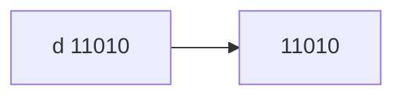

[18/07/2024]

Section - 3

# Object class

  

1. It is super most class of all the classes in java.

2. Object class shares all the properties to subclasses.

3. it contains **11** non-static methods.

  

***11 non-static methods***

  

1. public String toString();

2. public boolean equals(Object obj)

3. public in hashCode()

4. protected Object clone() throws CloneNotSupportedExeption

5. protected void finalize()

6. final public wait() throws InterruptedException

7. final public wait(long l) throws InterruptedException

8. final public wait(long l, int i) throws InterruptedException

9. final public void notify() throws InterruptedException

10. final public void notifyAll() throws InterruptedException

11. final public void getClass()

***toString()***

- toString() method returns String.
- toString() implementation of Object class returns the reference of an object in the string format.

**Return Format** ClassName@HexaDeciaml

>***Example***

```java
class Demo
{
	public static void main(String[] args)
	{
		Demo d = new Demo();
		System.out.println(d);
	}
}
```


***Purpose of Overriding toString***():

We override toString() method to print state of an object instead of printing reference of an object.

>***Example:***

```java
class Circle
{
	Circle(int radius)
	{
		this.radius = radius;
	}
	int radius;
	@Override
	public String toString()
	{
		return "radius : "+radius;
	}
	public static void main(String[] args)
	{
		Circle C = new Circle(5);
		System.out.println(c); // c.toString();
	}
}	
``` 

>***NOTE***:
>1. Java doesn't provide the real address of an object.
>2. Whenever programmer tries to print the reference variable toString() is implicitly called.

[equales-example](Object_class)