# Cases
### Case 1
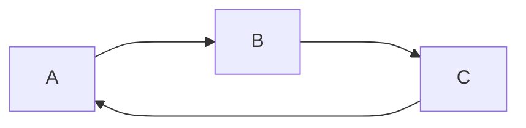
### Not possible 
1. **B** inherits from **A**
2. **C** inherits from **B**
3. **A** inherits from **C**
Due to multi-level inheritance This case in not possible.

### Case 2
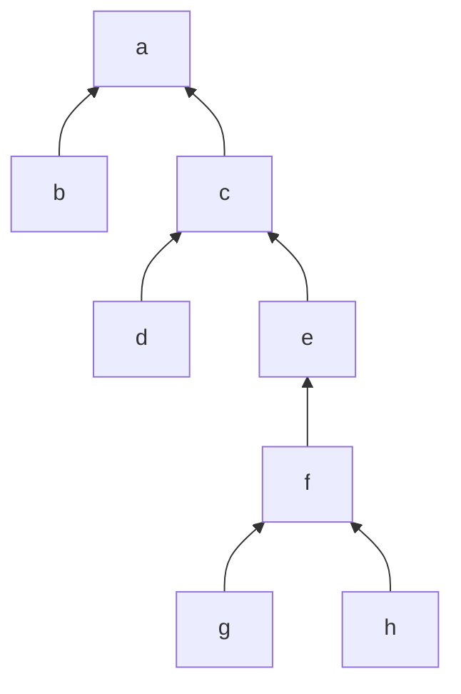
## Understanding Reference variable
1. One object can be referred to with multiple reference variables 
2. we can copy the reference of one object into multiple reference variables.

**Example**
```java
class Student {
	String sname;
}

Student s1 = new Student();
Student s2 = s1;
Student s3 = s1;
```
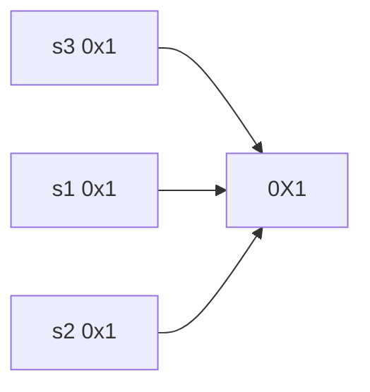

>**Note**
>We can access the members of the student object by using **s1 or s2 or s3**. [The state of the object can be modified by using any of the reference variables].
>We can copy the reference from one variable to another variable only if both the reference variable are the same type
>if both

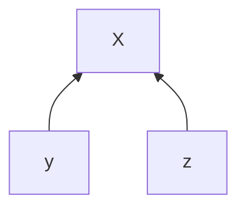

**Upcasting:**
```java
Parent p = new Child();
p x //possible
p z // not possible
```
**Down Casting:**
```java
Child2 c = (child2)p;
c.x // possible
c.y // possible
```
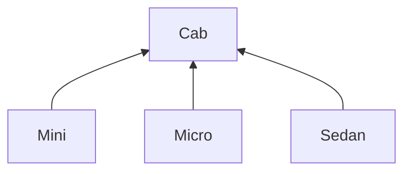
```java
Cab C;
C = new Mini(); //Up-casting;
C = new Micro(); //Up-casting;
C = new Sedan(); //Up-casting;
```
1. Now **C** is generalized, whenever anything is generalized then the upcasting will always happen.
2. We have to do down-casting to access the child class.

##  Non-Primitive typecasting / derived typecasting

 The process of converting one reference type into another reference type is known as non-primitive or derived typecasting
 
***Rules to achieve non-primitive typecasting***
 We can convert one reference type into another reference type only if it satisfies the following conditions

 - Is-a-relationship
 - common child

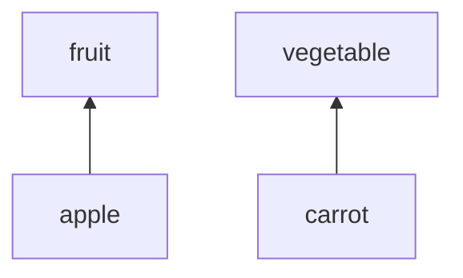
1. Fruit can be converted to apple and apple can be converted to fruit . As well as Vegetable can be converted to carrot and carrot can be converted to Vegetable.

2. But fruit and apple cannot be converted to vegetable and carrot .As well as Vegetable and carrot cannot be converted to Fruit and Apple

**Example 2**
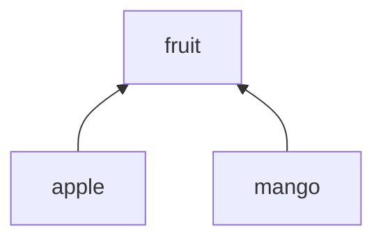

4. Fruit can be converted to apple and mango as well as apple and mango can be converted to fruit 
5. But apple cannot be converted to mango as well as mango cannot be converted to apple.

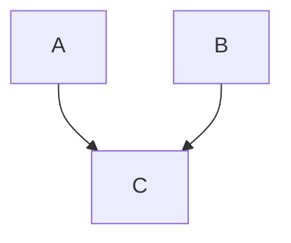

1. We can convert A to B , B to A, A to C, C to A, B to C and C to B.

## Types of non-primitive typecasting 

non primitive is classified into 2 types.
1. Up-casting
2. Down-casting

### Up-casting:
The process of converting child class reference to parent type reference is known as up-casting.
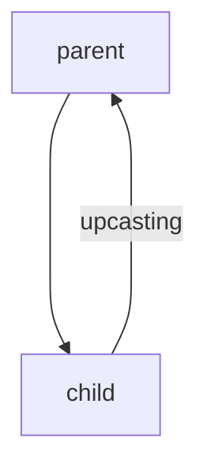

 - The upcasting is done by the compiler implicitly. 
 - Upcasting can also be done explicitly with the help of typecast operator. 
 - Once the reference is upcasted we cannot access the members of child class.
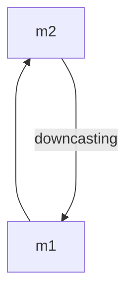
```java
Child C = new Child();
Parent P = C;
	   P.m1();
	   p.m2()
```
>**Note** 
>In the above example **P** is upcasted reference, so we can access only parent class member but not enter code herechild class members.

[09/07/2024]

**Why do we need up-casting?**

1. It is used to achieve generalization 
2. It helps to create generalized container, So that the reference of any type of child object can be stored

>**Example**
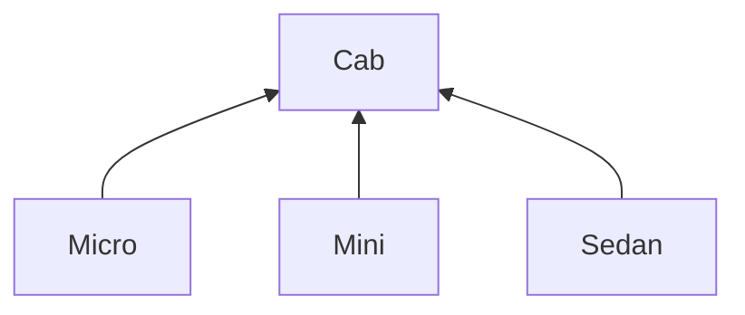
```java
Cab C;
C = new Micro();
C = new Mini();
C = new Sedan();
```

>**Note:**
>In the above example **C** is acting like a generalized container as it can store any child object.

***Disadvantage of Up-casting :***
There is only one disadvantage of upcasting , that is
1. Once upcast is referenced then members of child cannot be used. Or we cannot access the members of child class
To overcome this problem we go for down-casting

### Down-casting:
- The process of converting parent reference type to child reference type is known as Down-casting.
- Down-casting is not implicitly done by the compiler, It should be done explicitly by the programmer with the help of typecast operator.

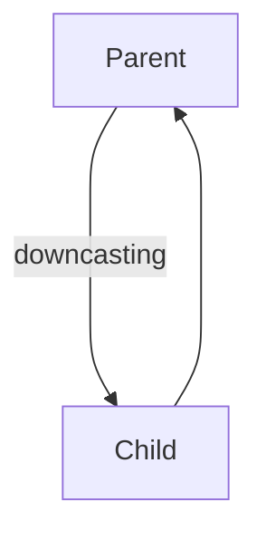
**Purpose of Down-casting**
If the reference is upcasted we cannot use child class members , to use members of child class we need to down-casting to the child class.

**Class cast exception**
It is a runtime exception
It is a problem the occurs during runtime while down-casting.

### Why and when we get 'Class cast exception'
When we try to convert reference to specific type **(Class)** and the object does not have the instance of that type then we get **class cast exception**
>**Example:**
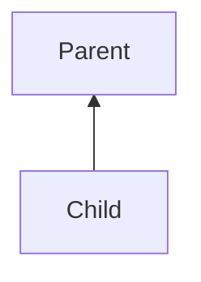

```java
Child c = (Child) new Parent();
```
***Instance-of operator***

1. It is a binary operator
2. It is used to test if an object is of given type 
3. The return type of this operator is **Boolean**.
4. If this specified object is of given type , then this operator will return **True** or else **False**.

>**Syntax**
```java
ref_Var instanceof ClassName;
```
Is-A-Relationship must exist between `ref_var` and `ClassName` ,
otherwise, we will get compile time error.

[10/07/2024]
## Polymorphism

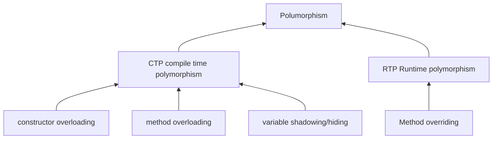
- The ability of an object showing different behaviors at different stages of its lifecycle is known as polymorphism.
- In java we can achieve with the help of methods, that means methods showing different behaviors at different situation.
- There are two types of polymorphism 
			- compile time polymorphism
			- runtime polymorphism 

***compile time polymorphism***
1. When method declaration and method body get bind together at compile time is known as compile time polymorphism
2. It is also known as early binding or static binding 
3. As binding is happening at compile time so rebinding is not possible. 
4. We can achieve compile time polymorphism with 
				- constructor overloading
				- method overloading
				- variable shadowing

***Method overloading***
	creating/developing multiple method with same name but different formal arguments is known as method overloading.
	
**Rules of method overloading**

1. Length of the arguments can be changed.
2. Type of the arguments can be changed.
3. Position of the argument can be changed.
4. Return type can be changed.
5. Access specifier can be changed.
6. Even modifier can changed.

>**NOTE:**
>In method overloading method signature must be different 

> ***Example:***
```java
class MethodOverloading{
	public static void m1(){
		System.out.println("Method 1");
	}
	public static void m1(int a){
		System.out.println("Method 2");
	}
	public static void m1(int a, int b){
		System.out.println("Method 3");
	}
	void m1(int a, float b){
		System.out.println("Method 4"):
	}
}
class MethodOverloadingMain{
	public static void main(String args[]){
		MethodOverloading.m1();
		MethodOverloading.m1(10);
		MethodOverloading mol = new MethodOverloading();
		mol.m1(10,45f);
	}
}
```
***Output***
```java
Method 1
Method 2
Method 4
```
[11/07/2024]
### Variable shadowing:
If super class and sub class have variables with same name, it is known as variable shadowing.
***Qn : Which variable is used depends on what?***
- In variable shadowing binding is done at compile time so variable used depends on the reference type but not depends on the object created.

>***NOTE***
>Its is applicable for both static and non-static variable.

***Example***
```java
class A
{
	String name = "Vinoth";
}
class B extends A
{
	String name = "Reyaan";
}
class ABMain{
	B b = new B();
	b.name; //Reyaan
}
```
## Method overriding:

- If method declaration and method body gets bind in runtime is known as runtime polymorphism
- It is also known as dynamic binding or late binding.
- As binding is happening at runtime so rebinding is possible.
- We can achieve runtime polymorphism with the help of method overring.

***Method overriding:***
- If subclass and superclass have non-static methods with same signature, it is known as method overriding.

>***RULES:***
1. Is-A-Relationship is mandatory.
2. Method signature must be same.
3. It is only applicable for non-static.
4. We cannot change return type except non-primitive (Can be of co-variant type).
5. Access specifier can be same, or it can be of higher visibility.

**PURPOSE OF METHOD OVERRIDING:**

1. We override method to change the implementation of existing method. 
2. **@Override** informs the compiler that the element is meant to override and element declared in super class.
3. If programmer does not mention **@Override**, Still it will be considered as overriding method.


***QN - Method implementation depends on what?***
As it is runtime polymorphism, so method implementation depends on the type of object created but not reference type.

>**Example**
```java
class Parent
{
	public void m1()
	{
		System.out.println("M1 Method in parent class");
	}
}
class Child extends Parent
{
	@Override
	public void m1()
	{
		super.m1();
		System.out.println("M1 method in child class");
	}
}
class ParentChildMain
{
	public static void main(String args[])
	{
		Parent c = new Child();
		c.m1(); //M1 method in child class
		Child x = new Child();
		x.m1(); //M1 method in child class
		Parent c = new Child();
		c.m1(); 
		//M1 method in child class
		//M1 method in child class
	}
}
```
[12/07/2024]
## Final modifier:
- It indicates that object is fixed and cannot be changed. 
- It is applicable variables, methods and classes.

***Final Variable***

- If a variable is prefixed with final modifier then, the value of the variable remains constant, Once it get initialized.
- If we try to change or modify the value of final variable then we will get compile time error.

>***Example***

```java
class Final
{
	public static void main(String args[])
	{
		final int x = 10;
		final int y; // blank final variable
		System.out.println(x);// prints 10;
		y = 20; // final initialization.
		System.out.println(y);// prints 20;
		y = 30; // CTE
		x = 40; //CTE
	}
}
```

***Final Methods***

- If a method is prefixed with final modifier then, the override of that method is not possible.
- If we try to override that method we get compile time error.

```java
class A
{ 
	final m1()
	{
		System.out.println("M1");
	}
}

class B extends A
{
	@overide //CTE;
	final m1()
	{
		System.out.println("M1");
	}
}
```
>***NOTE***
>final methods are inherited.

***Final Class***

- If a class is prefix with final modifier, then we cannot inherit the class.

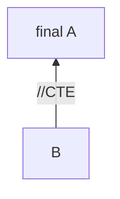
```java
 B extends A // CTE;
```
[13/07/24]
## Abstraction:

- The process of hiding implementation and showing only functionality is known as abstraction.
- We can achieve in java with the help of `abstract classes` and `interfaces`
- ***Abstract***
	- Abstract is a keyword in java which means **'incomplete'**
	- It is applicable for **Methods, Classes and interfaces**.
1. Abstract Class
2. Concrete Class
3. Abstract Methos
4. Concrete Methods

### Abstract class:

- The classes which are prefixed with abstract keyword is known as abstract classes.
- It is also known as incomplete class.

>**Syntax**

```java
abstact class className{

}
```
***Concrete classes:***
- the class which are not prefix with abstract is concrete class
- Normal classes are concrete classes

***Abstract Methods:***

- The methods which are prefix with abstract keyword is known as abstract method.
- It is also known as incomplete method.
- These methods always end with semicolon `;`.
- Abstract Methods Don't have any implementation.

***Concrete Methods:***

- The methods which are not prefix with abstract keyword is known as concrete methods , that is normal methods are concrete methods.

***Different observations in abstract classes:***

1. If any method is abstract in a class, it is mandatory to class as abstract.

>**Example**
```java
abstract class Abstract
{
	abstract public void m1();
}
```
2. If abstract method is present in a class, then child class is responsible to give implementation of the method by overriding it.
>**Example**
```java
abstract class Abstract
{ 
	abstract public void m1();
}
class Child extends Abstract
{
	@override
	public void m1()
	{
		System.out.println("Concrete method in child");
	}
}
```

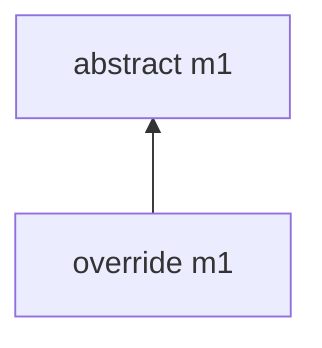
3. We can write any number of abstract methods in a class.
>**Example**
```java
abstract class Abstract
{ 
	abstract public void m1();
	abstract public void m2();
}
class Child extends Abstract
{
	@override
	public void m1()
	{
		System.out.println("Concrete method in child");
	}
	@override
	public void m2()
	{
		System.out.println("Concrete method in child");
	}
}
```
4. We can write any number of concrete methods also inside abstract class.
```java
abstract  class  Abstract  
{  
	abstract  public  void  m1();
	abstract  public  void  m2();  
	public void m3()
	{
	System.out.println("Concrete method in parent"); 
	}
}
 class  Child  extends  Abstract  
 {  
	 @override  
	 public  void  m1()  
	 { 
		 System.out.println("Concrete method in child");  
	 }  
	@override  
	public  void  m2()  
	{ 
		System.out.println("Concrete method in child");  		    
	}  
}
```
5. We cannot instantiate the abstract class.
	- Instantiate means creating an **Object**.  
6. Constructors are allowed in abstract classes.
	- It is allowed for **constructor chaining purpose**. 	 
7. If Child class is not responsible to give implementation of any abstract method of parent class, then child class is mandatory to make as abstract class.
```java
abstract class Abstract
{ 
	abstract public void m1();
	abstract public void m2();
	abstract public void m4();
	public void m3()
	{
		System.out.println("Concrete method in parent");
	}
}
abstract class child extends Abstract
{
	@override
	public void m1()
	{
		System.out.println("Concrete method in child");
	}
	@override
	public void m2()
	{
		System.out.println("Concrete method in child");
	}
}
```
8. If Child class is not responsible to give implementation of any abstract method of parent class, then next level of subclass is responsible to provide implementation for left out abstract methods.
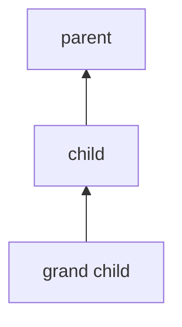
- grand child is responsible for the implementation of non-implemented method.

9. We can write static and non-static variables inside the abstract class.
```java
abstract class Abstract
{
	static int number;
	int num;
}
``` 
10. If there is no abstract method in a class still we can make class as abstract.
```java
abstract class Abstract
{
	public void m1()
	{
		System.out.println("Concrete method in parent");
	}
}
```
- To restrict the object creation.
11. We cannot make abstract classes and abstract methods as final.
	-	***Reason:***
	- Final methods are not overridden by the child or sub classes so the final key words are not allowed to create abstract class or methods. 

# Interface:

***Diamond problem graph***:
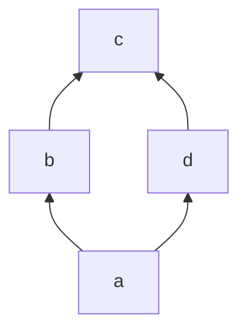
Constructors are not allowed so diamond problem will not occur.

---
***Definition***:
- Interfaces is another java component.
- It is used to achieve 
	- 1. ***100% abstraction***.
	- 2. ***Multiple inheritance***.

**Syntax to Interface**:

```java
  [abstract] interface InterfaceName
  {
	  // Interface Initializers;
  }
```

***Characteristics of Interface***:

---
1. ***Constructors*** are not allowed in interface.
2. variables are by default `public static Final`.
3. Methods are by default `public abstract`.
4. We cannot write ***non-static variables*** in interface.
5. We ***cannot instantiate*** interface.
6. blank ***Final variables*** are not allowed.
---
```java
interface InterfaceName
{
	int a = 10;
	void m1();
}
```
Internal addition by the compiler.
```java
[abstract] interface InterfaceName
{
	[public static final] int a = 10;
	[public abstract] void m1();
}
```
***Different observations in Interfaces***

1.Child classes can only implement a interface using ***implements*** keyword.
```java
interface I1
{

}
class A implements I1
{

}
```
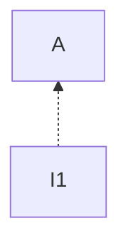
2. A sub class an ***implement two or more interfaces at the same time*** achieving multiple inheritance
3. Classes, subclasses can implement 2 or more interfaces as well as can inherit 1 class also
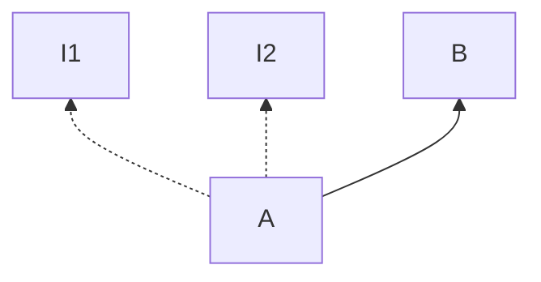
```java
A extends B implements I1,I2
```
[16/07/2024]
>***NOTE:***
>extends key word must come before implements key word.

4. Interface cannot implement or inherit the class.
	- Interface should be on top. 
```mermaid
graph TB
a[A]
a-- x -->i[I]
i-.->a
```

5. A interface can inherit 2 or more interfaces at the same time.

```mermaid
graph BT
a[I3]
b[I2]
c[I1]
d[A]
a--extends-->b
a--extends-->c
d--implements-->a
```
```java
	I3 extends I1,I2
	A implements I3
```

***Java 8 editions***:
1. `Public static concrete method` is allowed in interface.
2. Default non-static method is allowed in interface.

***Example***
```java
[abstract] interface I
{
	public static void m1()
	{
	
	}
	default void m2()
	{
	
	}
}
```

```mermaid
graph BT
a[I1 m1]
b[I2 m1]
c[A I1.m1 I2.m1]
c-.->a
c-.->b
```
***Difference between Abstract class and Interfaces***:

| Abstract | Interfaces |
|-----------|----------------|
|we cannot achieve 100% abstraction | we can achieve 100% abstraction|
| multiple inheritance is not possible | multiple inheritance is possible|
|constructors are  allowed| constructors are not allowed|
|classes are inherit on another class using extends keyword | classes can only implemented to implements key word only|
|variables are not by default `public static final`|variables are by default `public static final`|
methods are not by default `public abstract` | Methods are by default `public abstract`|
|we can write non -static variables in abstract classes | we cannot write non-static variables |
|Multi-line initializers we can write. | we cannot write multi line initializers|
|static methods are inherited to subclass | static methods are not inherited |
| default key word is not allowed | default key word is allowed |
|instantiation is not possible | instantiation is not possible|
|any type of concrete method is allowed | only public static and default non static concrete method is allowed (in java 8 version)|

[18/07/2024]