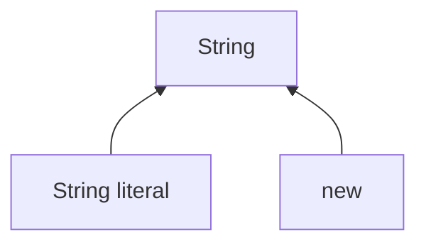

[20/07/2024]

## String class:

***Types of creating String***



>**Example**

```java
String s1 = "mango";
String s2 = new String("Pineapple");
String s3 = new String();
	   s3 = "Apple";
```
**String**:
String is a literal (data). It is a group of character that is enclosed within the double quote "".

- It is a Non primitive data.
- In java we can store a string by creating instance of the following classes.
  - ***java.lang.String***
  - ***java.lang.StringBuffer***
  - ***java.lang.StringBuilder***
- In java, whenever we create a string compiler implicitly create an instance for `java.lang.string` in string pool area/ string constant pool (scp).

***String Literals***:

Anything enclosed within the double quote "" in java is considered as Sting literal.

***Characteristics of String Literal***:

- When a String literal is used in a java program, an instance of `java.lang.String` class is created inside a String pool.
- For the given String literal, If the instance of a string is already present, then new instance is not created instead the reference of a existing instance is given.