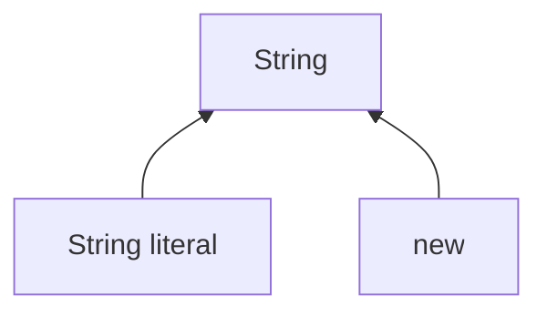

[20/07/2024]

## String class:

***Types of creating String***


```mermaid
graph BT

a[String]
b[String literal]
c[ new]
b-->a
c-->a
```

>**Example**

```java
String s1 = "mango";
String s2 = new String("Pineapple");
String s3 = new String();
	   s3 = "Apple";
```

